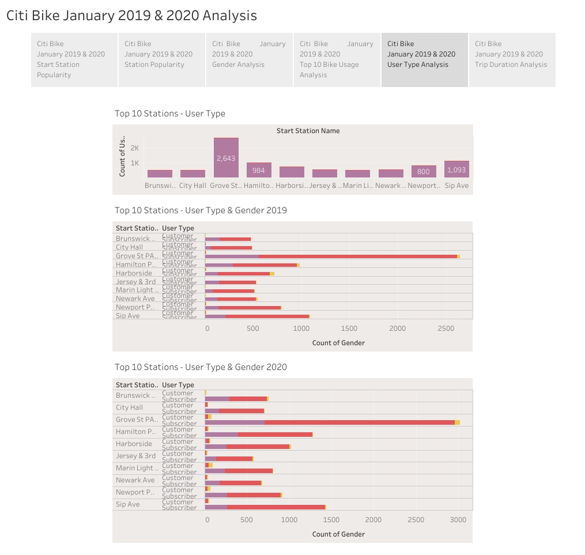
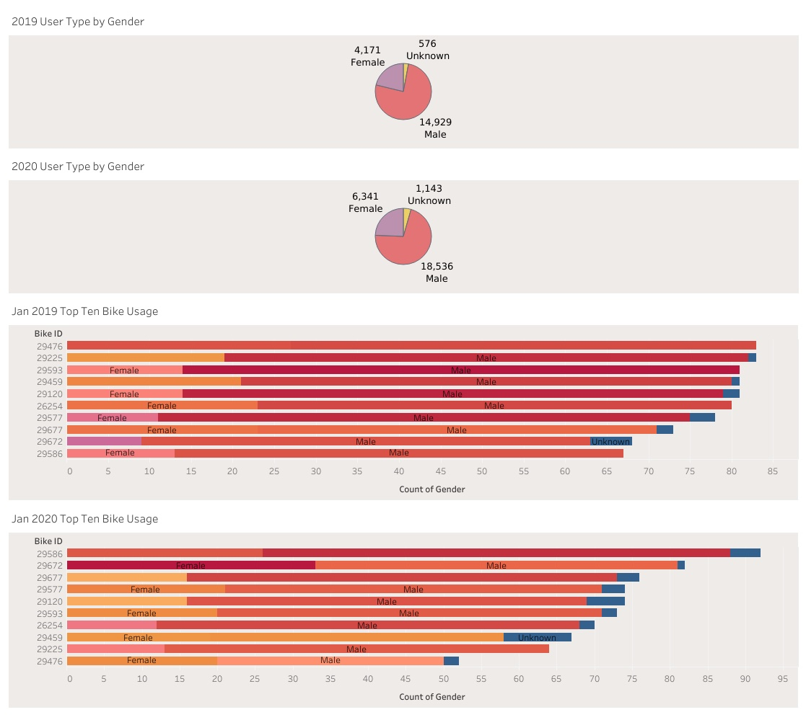
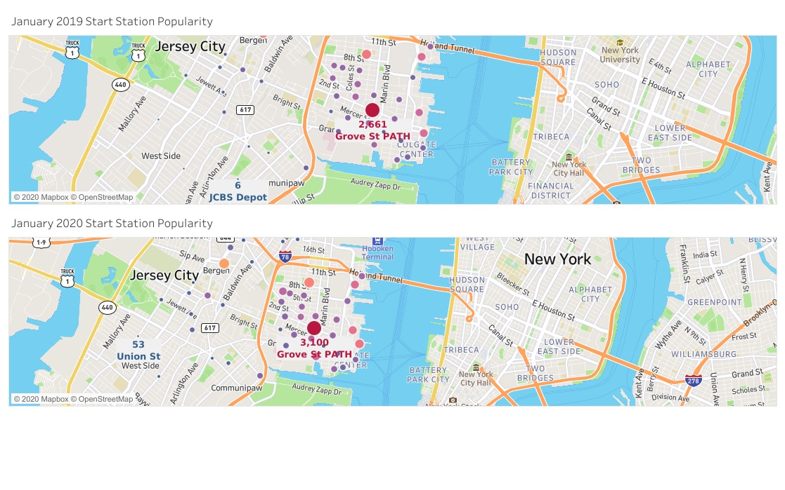

# Tableau Citi Bike Analytics

## Tableau Dashboard Link:
https://public.tableau.com/views/CitiBikeJanuary20192020GenderAnalysis/CitiBikeJanuary20192020Analysis?:language=en&:display_count=y&publish=yes&:origin=viz_share_link

Since 2013, the Citi Bike Program has implemented a robust infrastructure for collecting data on the program's utilization. Through the team's efforts, each month bike data is collected, organized, and made public on the [Citi Bike Data](https://www.citibikenyc.com/system-data) webpage.

However, while the data has been regularly updated, the team has yet to implement a dashboard or sophisticated reporting process. City officials have a number of questions on the program, so your first task on the job is to build a set of data reports to provide the answers.

## Tableau Dashboards:

